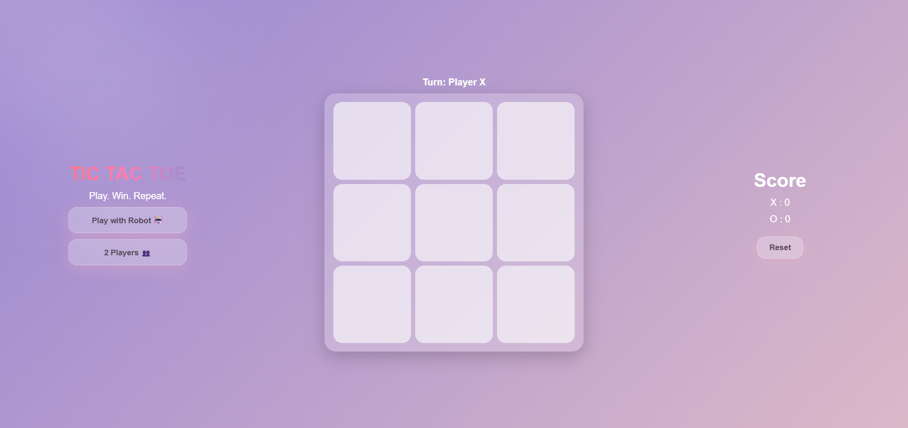

# 🎮 Tic Tac Toe Game

A modern and interactive Tic Tac Toe game built using frontend development technologies, featuring a clean UI and engaging user experience.

## ✨ Features

* 🎯 Two Player Mode
* 🤖 Play with AI opponent
* 🎨 Glassmorphism UI design
* 💫 Smooth animations and transitions
* 🏆 Dynamic winner display with effects
* 🤝 Draw detection system

## 🚀 Tech Stack

* Frontend Development (UI/UX + Logic)

## 📸 Preview

## 🎮 How to Play

1. Select game mode (AI or Two Players)
2. Enter player details (if required)
3. Start the game
4. Enjoy!

---

Made with ❤️ by Gunashree
